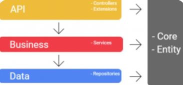
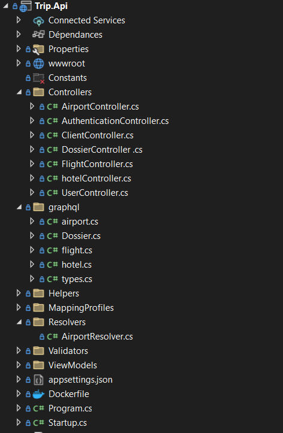
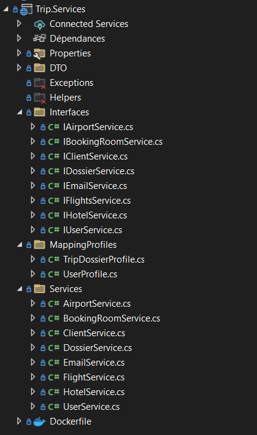
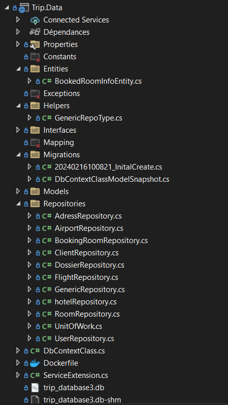
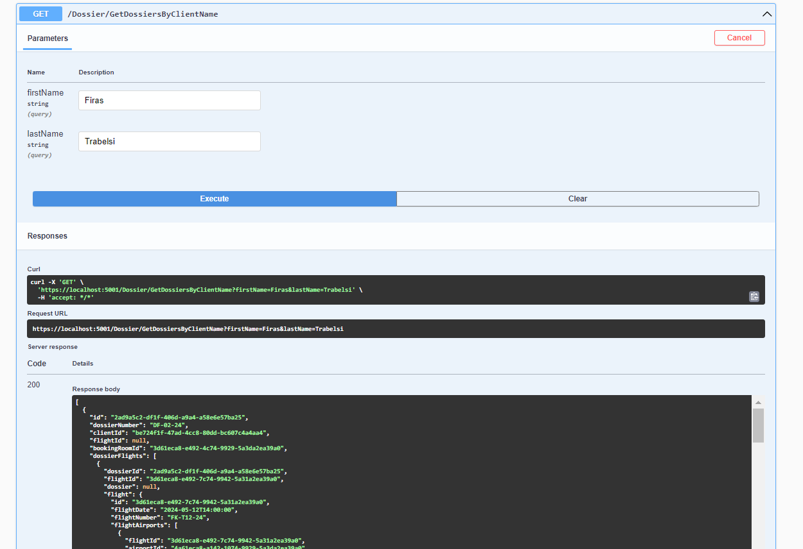
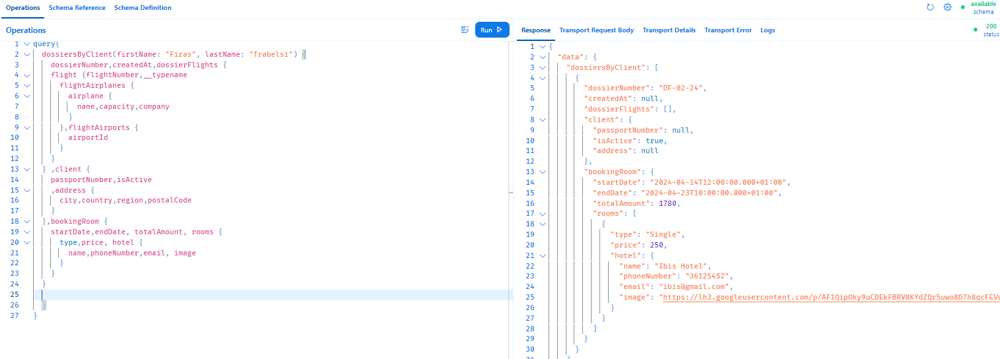
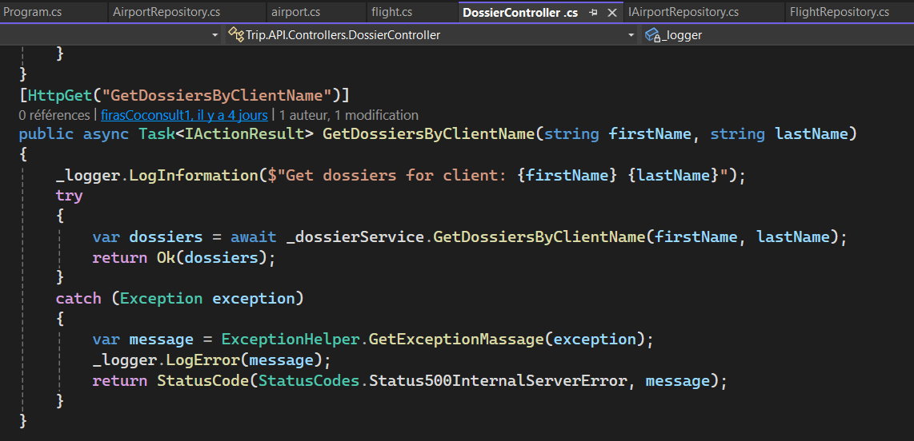
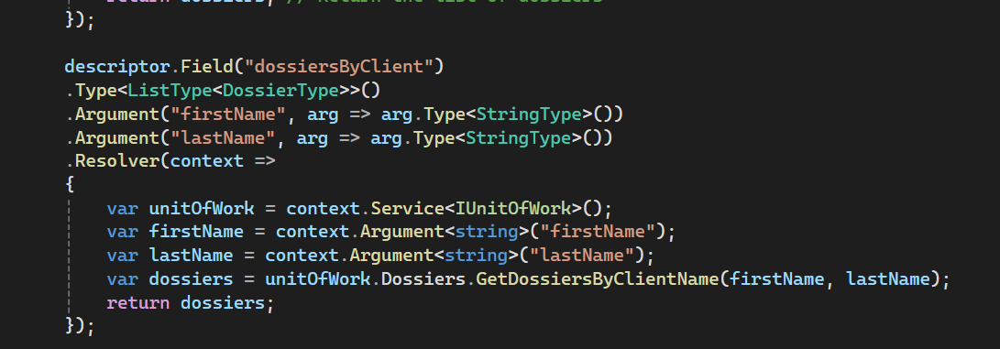

[![Contributors][contributors-shield]][contributors-url]
[![Forks][forks-shield]][forks-url]
[![Stargazers][stars-shield]][stars-url]
[![Issues][issues-shield]][issues-url]
[![MIT License][license-shield]][license-url]
[![LinkedIn][linkedin-shield]][linkedin-url]

<!-- PROJECT LOGO -->
<br />
<div align="center">
  <a href="#">
    
  </a>

  <h3 align="center">TRIP-APPLICATION</h3>
  <p align="center">
    You work for a travel agency. You are responsible for creating an application that allows
users to see details of their upcoming trip, using a GraphQL API like
intermediary for multiple REST APIs.
    <br />
    <a href="https://github.com/Firastrabelsi94/Trip-Application-Frontend/blob/TripBranch/README.md"><strong>Explore the docs »</strong></a>
    <br />
    <br />
    <a href="LINK TO YOUTUBE">View Demo</a>
    ·
    <a href="https://github.com/Firastrabelsi94/Trip-Application-Frontend/issues/new">Report Bug</a>
    ·
    <a href="https://github.com/Firastrabelsi94/Trip-Application-Frontend">Request Contributor access</a>
  </p>
</div>

<!-- TABLE OF CONTENTS -->
<details>
  <summary>Table of Contents</summary>
  <ol>
    <li>
      <a href="#about-the-project">About The Project</a>
      <ul>
        <li><a href="#built-with">Built With</a></li>
      </ul>
    </li>
    <li>
      <a href="#getting-started">Getting Started</a>
      <ul>
        <li><a href="#prerequisites">Prerequisites</a></li>
        <li><a href="#installation">Installation</a></li>
      </ul>
    </li>
    <li><a href="#usage">Code Samples</a></li>
    <li><a href="#roadmap">Roadmap</a></li>
    <li><a href="#contributing">Contributing</a></li>
    <li><a href="#contact">Contact</a></li>
  </ol>
</details>

<!-- ABOUT THE PROJECT -->

## About The Project

<style>
.container {
  display: grid;
 align-items: left; 
 grid-template-columns: 0.2fr 1fr 1fr;
 column-gap: 15px;
}
img {
  max-width: 100%;
  max-height:100%;
}

.text {
  font-size: 14px;
}
</style>

 <div class="container">
      <div class="image">
<a href="http://localhost:5000/swagger"></a>
      </div>
      <div class="text">
Whenever one starts to explore places around the globe, one of the most exciting places to visit is the continent of Africa/Europe/Asia. There is so much unexplored beauty in Africa for example and other countries like the coasts of South Africa, the untamed fields of savannah and other monuments located in the Egypt. So, to Start Travel Agency Business in Africa will be an amazing idea and one must pursue this thought. With us, we can make it easy for you, by just some clicks you can book all your needs to meet the luxury and the comfort during your visit.
In this project, you can find list of api rest and resolvers of GraphQl to get the needed information from the database and to store new files there.
  </div>
</div>
  
<br/>
* Create new Travel file according your choice by including Flights or Hotel roms and even both <br/>
* We offer the possibility to book also in same file for your involved parties (Fellow Travellers)<br/>
* Paiement can be done via Stripe in security (Feature onGoing)<br/>

Of course, this MVP version is not supporting all features, still proof of concept and then can be enhanced with more features. Your satisfaction is our target.<br/>
This backend project is following 3-layers architecture, N-tier architecture is a software design pattern that divides an application into multiple layers. 
In .NET Core Web API, N-tier architecture can be implemented by creating separate projects for each layer. Each layer is responsible for a specific task, and the layers are loosely coupled, meaning that they do not depend on each other for the following reasons: <br/>
- It improves the scalability of the application.
- It makes the application easier to maintain and test.
- It makes the application more secure.
- It makes the application easier to develop and deploy.<br/>


<p align="right">(<a href="#readme-top">back to top</a>)</p>

### Built With

<hr/>
This section should list any major frameworks/libraries used to create our project from Dev/Design and Deploy perspective.

- [![Sonar][Sonar.js]][Sonar-url]
- [![DotNet][.dotnet.js]][.DotNet-url]
- [![DotNet][EF.js]][EF-url]
- [![Sonar][Docker.js]][Docker-url]
- [![SQLite][SQLite.js]][SQLite-url]
- [![layers][Layers.js]][Layers-url]

<p align="right">(<a href="#readme-top">back to top</a>)</p>

<h3><b><p style="color:#003791">BACK-END PART</p></b></h3>
<!-- GETTING STARTED -->
## Getting Started

This Backend project has been built with .Net Core 7 following the 3-layers architecture and using the patterns Repository and Unit of WOrk, I tried to cover 80% of code with unit Testing approach based on  xUnit and Moq libraries.
All our data are saved in Sqlite database following teh strategy Code First, that's mean I created the models and then the database has been generated (migrated) using dotnet migrate command line.
I did a static code analysis for our code to ensure that I haven't technical debt in the developed application as shown below :

### Prerequisites

<hr/>

<p>1. Having .netCore 7, if not you can install it from https://learn.microsoft.com/en-us/dotnet/core/install/windows?tabs=net80</p>
<p>2. Having a tool to consult schema of the database as DB Visualizer or SQLite Viewer. </p>
<p>3. Having Visual Code or Visual studio to open the solution.</p>

### Installation

<hr/>

<p>1. Run SonarQube
 First open windows services from Start Menu => Run => ServicesMsc, Search for Docker and right click then Start. After that go to application terminal and Built the image and wait Sonar to finalize the analysis.

```sh
docker compose up
```

2. Build images using docker:

```sh
   docker build . -t "trip_front:v1.0"
```

3. We can now check the list of available docker images on our local system by running the following command:

```sh
   docker images
```

4. Let’s now try running this image; which is now called a container. Run the following command to spin up a container based on the image "trip_front:v1.0"

```sh
   docker run -p 8080:8080 "trip_front:v1.0"
```

<p align="right">(<a href="#readme-top">back to top</a>)</p>


<!-- Code EXAMPLES -->

## Back Code Samples

As I mentioned previously, this backend project is following 3-layers architecture as shown below:<br/>
- Let's start with structure of the Presentation layer (Api layer) which contains our controllers<br/>
<br/>
- Then move to consult the structure of the Business layer which contains our services<br/>
<br/>
- Finally end with structure of the Data layer (Repo layer) which contains our repositories<br/>
<br/>

<p>Before going through some code samples, is better to have a clear vision about the class/ER diagram of the application</p>
<br/>
<hr/>
0. Controller:<br/>
   In this example, I will show you an example of controller part for GraphQL implementation in order to get list of reservation. So first let's see the pi responsible to retrieve data from database<br/>
   <br/> 
   And below, the graphQL query and result pointing on this Api.<br/>
   <br/>
   You can see also here the code responsible for API creation inside its controller "DossierController" in the API layer.<br/>
   <br/>
   To be able to have GraphQL runing in the right way, we need to create a type for our dossier (Resolver) as shown below:
    <br/>
   <hr/>
1. Service:<br/>
   In this example, I will show you an example of controller part for GraphQL implementation in order to get list of reservation. So first let's see the pi responsible to retrieve data from database<br/>
   <br/> 
   And below, the graphQL query and result pointing on this Api.<br/>
   <br/>
   You can see also here the code responsible for API creation inside its controller "DossierController" in the API layer.<br/>
   <br/>
   To be able to have GraphQL runing in the right way, we need to create a type for our dossier (Resolver) as shown below:
    <br/>
<hr/>
    2. Data:<br/>
   In this example, I will show you an example of controller part for GraphQL implementation in order to get list of reservation. So first let's see the pi responsible to retrieve data from database<br/>
   <br/> 
   And below, the graphQL query and result pointing on this Api.<br/>
   <br/>
   You can see also here the code responsible for API creation inside its controller "DossierController" in the API layer.<br/>
   <br/>
   To be able to have GraphQL runing in the right way, we need to create a type for our dossier (Resolver) as shown below:
    <br/>

<!-- ROADMAP -->

## Roadmap

- [Done] Add Changelog
- [Done] Add back to top links
- [Done] Create needed APIs (Rest with the GraphQL Resolvers)
- [InProgress] Using Authentication controller for MFA &  access token and refresh token in Http secure cookies (I have knowledge to do it but not done cause of time constraint)
- [Open] Caching in Server and Client side (I have knowledge to do it but there is no need in our case to implement it, we haven't master data that is not changed frequently to apply caching on it), besides that adding token in middleware layer for authorize APIs
- [Done] Multi-language Support in the application
- [Done] Unit test implementation with coverage 80% (Controller & Repository layers)
- [Done] Integrate Dockerization and SonarQube
- [InProgress] Rest Api for travel dossier creation.(cause of time constraint)

<p align="right">(<a href="#readme-top">back to top</a>)</p>

<!-- CONTRIBUTING -->

## Contributing

Contributions are what make this application such an amazing place to learn, inspire, and create. Any contributions you make are **greatly appreciated**.

If you have a suggestion that would make this better, please fork the repo and create a pull request. You can also simply open an issue with the tag "enhancement".
Don't forget to give the project a star if you like the idea (Draft App)! Thanks again!

1. Fork the Project
2. Create your Feature Branch (`git checkout -b feature/AmazingFeature`)
3. Commit your Changes (`git add .` then `git commit -m 'Add some AmazingFeature'`)
4. Push to the Branch (`git push origin feature/AmazingFeature`)
5. Open a Pull Request to the master branch

<p align="right">(<a href="#readme-top">back to top</a>)</p>

<!-- LICENSE -->

## License

Distributed under the MIT License. Developed for external client on behalf of CoConsult.

<p align="right">(<a href="#readme-top">back to top</a>)</p>

<!-- CONTACT -->

## Contact

Firas Trabelsi - [@your_twitter](https://twitter.com/your_username) - email@example.com

<p align="right">(<a href="#readme-top">back to top</a>)</p>

<!-- MARKDOWN LINKS & IMAGES -->

[contributors-shield]: https://img.shields.io/github/contributors/TrFiras/Trip_Backend.svg?style=for-the-badge
[contributors-url]: https://github.com/TrFiras/Trip_Backend/graphs/contributors
[forks-shield]: https://img.shields.io/github/forks/TrFiras/Trip_Backend.svg?style=for-the-badge
[forks-url]: https://github.com/TrFiras/Trip_Backend/network/members
[stars-shield]: https://img.shields.io/github/stars/TrFiras/Trip_Backend.svg?style=for-the-badge
[stars-url]: https://github.com/TrFiras/Trip_Backend/stargazers
[issues-shield]: https://img.shields.io/github/issues/TrFiras/Trip_Backendd.svg?style=for-the-badge
[issues-url]: https://github.com/TrFiras/Trip_Backend/issues
[license-shield]: https://img.shields.io/github/license/TrFiras/Trip_Backend.svg?style=for-the-badge
[license-url]: https://github.com/TrFiras/Trip_Backend/blob/master/LICENSE.txt
[linkedin-shield]: https://img.shields.io/badge/-LinkedIn-black.svg?style=for-the-badge&logo=linkedin&colorB=555
[linkedin-url]: https://linkedin.com/in/Firastrabelsi94
[product-screenshot]: src/assets/trip.png
[EF.js]: https://img.shields.io/badge/ef-0769AD?style=for-the-badge&logo=sqlite&logoColor=%23ffafff&color=back
[EF-url]: https://learn.microsoft.com/en-us/ef/core/
[Sonar.js]: https://img.shields.io/sonar/coverage/swellaby%3Aletra?server=https%3A%2F%2Fsonarcloud.io&style=for-the-badge&logo=sonarqube&label=SonarQube&color=red
[Sonar-url]: http://sonarqube:9000
[.DotNet.js]: https://img.shields.io/badge/.NET%20Core-0769AD?style=for-the-badge&logo=dotnet&logoColor=%23ffffff
[.DotNet-url]: https://dotnet.microsoft.com/en-us/
[Docker.js]: https://img.shields.io/badge/Docker-0769AD?style=for-the-badge&logo=docker&logoColor=%23ffffff&color=purple
[Docker-url]: https://www.docker.com/
[SQLite.js]: https://img.shields.io/badge/SQLite-0769AD?style=for-the-badge&logo=sqlite&logoColor=%23ffffff&color=back
[SQLite-url]: https://www.sqlite.org/
[Layers.js]: https://img.shields.io/badge/3%20Layers%20Arch-0769AD?style=for-the-badge&logo=clarifai&logoColor=%23ffffff&color=pink
[Layers-url]: https://medium.com/@deanrubin/the-three-layered-architecture-fe30cb0e4a6
